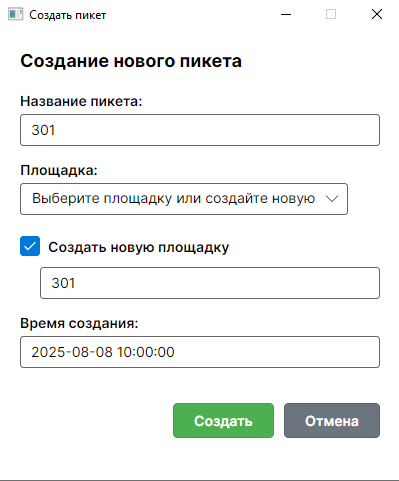

# Система управления складами

билд готовой для запуска версии работы, можно скачать архивом из репозитория:
https://github.com/AndySteelrail/warehouses_build/tree/main

### Выбранный технологический стек

- **ASP.NET Core 9.0**
- **Entity Framework Core**
- **PostgreSQL (17я версия)**
- **Avalonia UI**
- **EMX Controls** не использовал

Причина выбора: строго говоря, такой стек рекомендован самим заданием.  
Единственное - EMX Controls библиотека платная, скачал ознакомительный фрагмент - есть только в таком виде, триала на 30 дней нет теперь. Что-то позаимствовать затруднительно, нужно очень много вычищать. Да и, в общем-то обошёлся базовыми элементами Avalonia. Хотел дополнительно библиотеку на иконки поставить, но... версия Avalonia у меня оказалась слишком свежая, соответствующих версий нет. Рассматривал ```Font Awesome``` и ```Tabler```. Откатываться ради иконок на версию ранее не стал - уже много кода было написано.

### Архитектура - Backend

**Слоистая:**
```
Controllers (+DTO) → Services → Repositories → Database
```

В целом классика слоистой архитектуры. Слабая связность позволяет заменять сервисы и контроллеры. Что в том числе приходилось делать.
Контроллеры тонкие и наглядные. Логика в сервисах.
Базовый репозиторий определял основные CRUD-операции над таблицами, репозитории таблиц наследовали от него и дополняли.

#### Архитектура Frontend

**MVVM**
```
Views → ViewModels → Models(+DTO)
```

Тут скорей сам инструмент в лице авалонии такой паттерн диктует. В свою очередь, разбил компоненты-окна по своим функциям - CRUD'ы, диалоги, статус загрузки.


В целом, привычнее было бы сделать фронтенд на TS, React'е. С этими инструментами чуть более знаком. Тут же - была возможность познакомиться с Avalonia и это было предпочтением по реализации со стороны работодателя.


### Представление данных

Структуру БД можно представить через диаграмму ниже:


Поскольку нам нужно было состояние складов, площадок, пикетов в любое время, не сразу, но пришёл к "мягкому удалению" сущностей. Стал хранить время активности сущностей. Это позволило отображать состояние консистентно, а благодаря индексам не сильно терять в извлечении данных.

Коротко говоря, реализовано 6 сущностей:
С временем действия (создан-закрыт):
1. Склады с именем и ID.
2. Пикеты складов с именем и ID
3. Площадки с именем, ID, хранимым грузом
4. Таблица связей "многие ко многим" для пикетов и площадок
Таблицы операций над грузами:
5. Грузы, которые хранятся как остаток, приход и расход.
6. Типы грузов


### Общий подход к решению задачи

Создание и удаление складов и пикетов - операция редкая. Но функционал нужно было предусмотреть. При этом, создание первого пикета идёт в транзакции с созданием сразу площадки под него. "Докидывая" пикеты, можно создавать и по-разному конфигурировать площадки. При этом, как такового удаления площадок даже нет - есть распределение пикетов. Может быть как 1 площадка на 1 пикет, так и все пикеты склада в одной площадке.
Объединение площадок и грузов, также производится в транзакции.

Реализованы операции:  
 - редактирования (переименования)  
 - добавления пикета  
 - добавления площадки  
 - удаления сущности  
 - добавления/списания груза (прямо заданием не требовалось, но полезности для целостности продукта)

Реализованы проверки:
1. Уникальность имён одновременно существующих сущностей. При этом, сущности могут носить одно имя, если существуют в разное время.
2. Последовательности и неразрывности пикетов в площадке. Критерий - лексикографический (алфавитный) порядок имён.
3. Невозможность объединения площадок с разными грузами в одну. Допущение - площадки могут "воровать" при переопределении пикеты друг друга, кроме единственного оставшегося (на нём хранятся остатки груза).
4. Неотрицательность остатков груза в любой момент.
5. Объединение грузов одного типа при объединении площадок.
6. Фильтры по типам груза и дате/времени.  


В целом, проект получился массивным, но внимательно учитывающим потребности задачи. Благодаря достаточно сроку на реализации, сделал "с расширениями". Благодарю за опыт!

На всякий случай приведу скрины внешнего вида реализации.

Общий внешний вид:


Окно изменения конфигурации:


Ошибка при недопустимости действий:


Успешное объединение пикетов и грузов для склада 1:


Создание первого пикета на складе (одновременно с площадкой):
